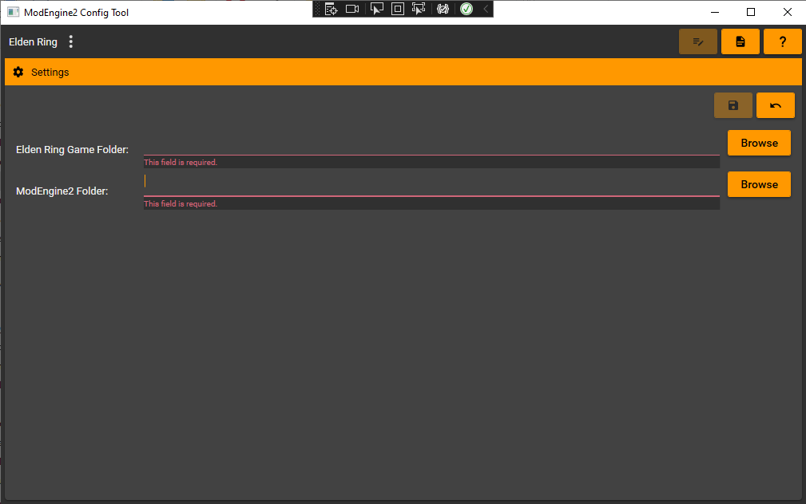
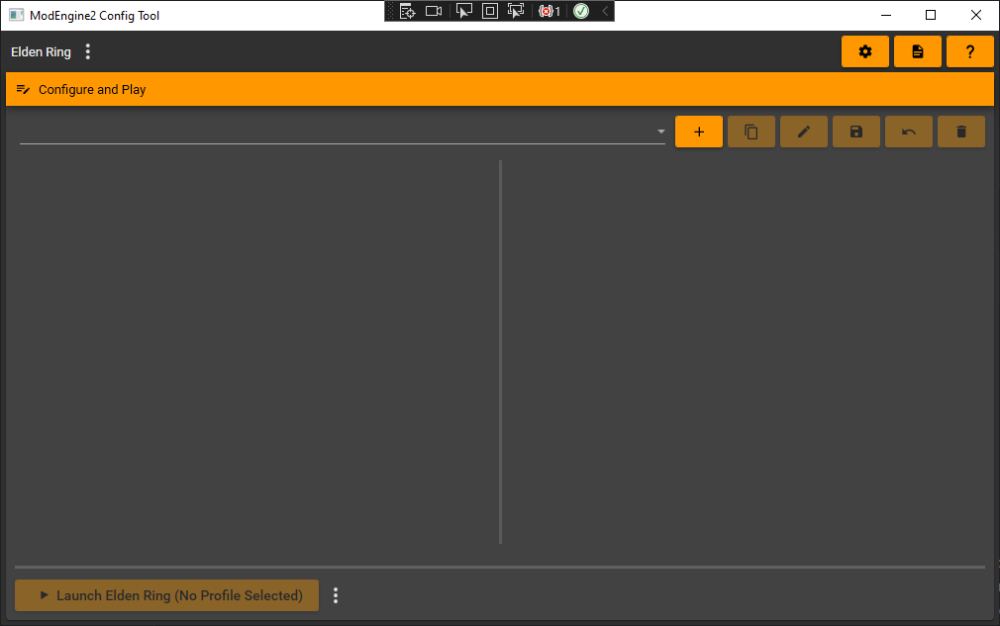
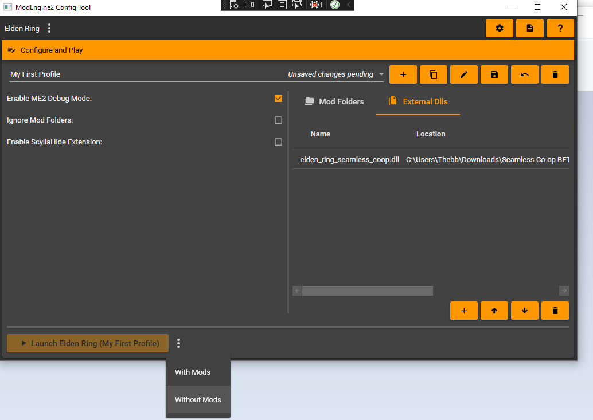

# ModEngine2 Config Tool

## Description

This is a .Net6 WPF based profile configuration tool ModEngine2, specifically designed to work with Elden Ring.

## How it works

ModEngine2 stores mod configurations in .toml files. This tool presents them in an interactive format and allows modification and management via a WPF user interface.

## Requirements

This tool requires you to have downloaded ModEngine2. You can find it here:

* [soulsmods/ModEngine2 Repository](https://github.com/soulsmods/ModEngine2)

## Currently Supported Games

* Elden Ring

# First time setup

### Settings

The first time you run the config tool you will be presented with the settings page and two empty fields.

The Elden Ring Game Folder field should be set to the location of the game folder inside your Elden Ring install. For example:

> H:\SteamLibrary\steamapps\common\ELDEN RING\Game

The ModEngine2 folder field should be set to the location of the ModEngine2 folder that you downloaded. This folder should contain files such as "modengine2_launcher.exe". For example:

> H:\Downloads\ModEngine2

Once you have completed these fields you should be able to click the save button and then select the now enabled "Configure and Play" button above.

 

### Profiles

Once you click the "Configure and Play" button you will be taken to the profiles screen shown below.

 

Click the Add button (+) below the Configure and Play header to add a new profile. You will be prompted with choose a name for the profile. When you click accept a new profile under that name will be created with a default configuration.

 

Once you have your profile created you can click the "Launch Elden Ring (*"Profile Name"*)" button to launch Elden Ring with your selected profiles options.

# Configuring a Profile

The configuration settings available for a profile are described below:

## Lefthand side options:

 

 

| **Options**        | **Description**   |
| ------------- |:-------------|
| Enable ME2 Debug Mode | This option will cause ModEngine2 to launch Elden Ring with the ModEngine2 debug console window attatched.  *Note: This is not recommended unless you want to gather extra debug information.*  | 
| Ignore Mod Folders      | This option prevents ModEngine2 from loading any of the Mod Folders selected in the Mod Folders section on the right hand side of the screen. |
| Enable ScyllaHide Extension | When enabled, scylly hide will be injected into the game. This allows for antidebug measures in the game to be bypassed so that you can attach debuggers such as Cheat Engine, x64dbg, windbg, etc to the game without as much trouble.  If you're not reverse engineering the game, this option is probably not for you. |

## Righthand side options:

 

| **Options**        | **Description**   |
| ------------- |:-------------|
| Mod Folders  | Choose the folders which contain the mod files you want to load. These folders contain files such as Regulation.bin and any "maps" or "msg" folders.  You can click the edit button to rename a mod folder within a profile, this does not change the name of the folder on disk. | 
| External Dlls  | Choose any external dlls you want to load.  For instance if you want to use Seamless Coop you should add the Seamless Coop dll to the list.|

## Additional Information

 

* Before you can launch a profile you must save any pending changes. If a profile has unsaved changes the option to launch with your selected profile will be disabled.

 

 

* You can choose to launch Elden Ring without mods by clicking the drop down option at the bottom and selecting "Without Mods". You can change back to launching with your profile again by clicking the drop down and selecting "With Mods". If your profile has unsaved changes you will not be able to reselect this option until it is saved or reverted. 

 

 
