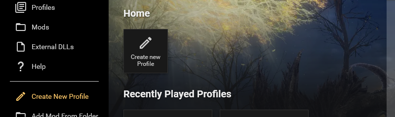
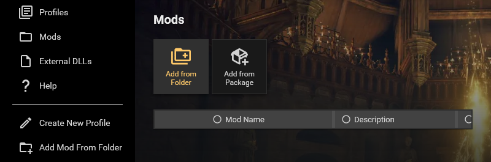
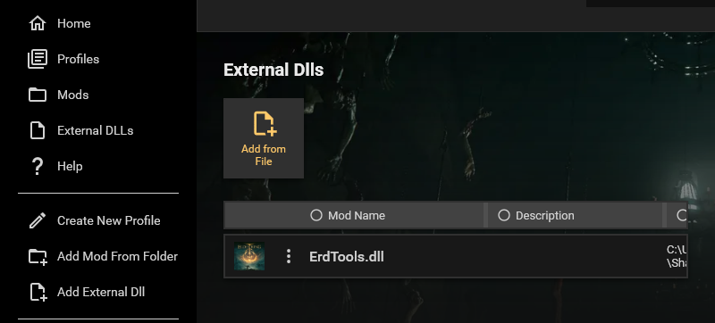

<h1> Metis Mod Launcher</h1>

## Description

Metis Mod Launcher is a tool designed to make using mods in Elden Ring via ModEngine2 a smoother experience.

ModEngine2 is a modding engine built by garyttierney, katalash and Dasaav-dsv which hooks into games and allows the replacement of files and injecting of dlls.

Metis Mod Launcher installs ModEngine2 and provides a user interface that allows collections of mods and dlls to be imported and saved in profiles with per profile save games. This allows players and mod developers to quickly swap between different mod configurations without having to worry about manually moving files around themselves.

## How it works

ModEngine2 stores mod configurations in .toml files. This tool presents them in an interactive format and allows modification and management via a WPF user interface.

Via file / folder selection you can select Mods and Dlls that are then recorded in an internal database. This database stores a reference to their location on disk and any additional details you give them.

You can then create profiles and select different mods and dlls to add to the profiles and set profiles to use their own save games. This should allow you to swap between different mods without it messing up your saved game.

## Currently Supported Games

* Elden Ring

## What this tool does not do!

* This tool does **not** download mods. To use a mod you must first download it and move it's files into a ME2 suitable arrangement. If the mod comes with a regulation.bin file it should be in the same top level folder as all the other mod files.

# Thanks

This launcher would not be possible without the efforts of [Gary Tierney](https://github.com/garyttierney), [katalash](https://github.com/katalash) and [Dasaav-dsv](https://github.com/Dasaav-dsv) for their work on https://github.com/soulsmods/ModEngine2. Please check out their other work for to see what else they have come up with.

All other libraries that have been used to create this tool such as Material Design in Xaml are licensed in the help page and I recommend people check those out too if they are interested.

# First time setup

Download the latest release `.msi` installer from the releases page.

Run the installer and then launch Metis Mod Launcher from the desktop shortcut.

# Using Metis Mod Launcher

## Creating a Profile

A new profile can be created from the Home and Profiles pages or via the sidebar "Create New Profile" option:

When you click this button a new profile will be created and you will be taken to this Profile to edit it. 

### <u>Options</u>

A profile has the following fields:

| **Options**        | **Description**   |
| ------------- |:-------------|
| Name | The name of the profile.  Multiple profiles may have the same name.
| Description | Any additional description you want to give to the profile.|
| Created | The DateTime that the profile was created.  Cannot be edited, will be automatically updated. |
| Last Played | The last time the profile was played.  Cannot be edited, will be automatically updated. |
| Selected Mods | The mods selected for this profile.  You cannot select the same mod more than once. |
| Selected External Dlls | The external dlls selected for this profile.  You cannot select the same dll more than once. |

\* Cannot be edited, will be automatically updated.

### <u>Advanced Options</u>

There are also a number of Advanced options:

| **Advanced Options**        | **Description**   |
| ------------- |:-------------|
| Profile Id * | The internal Id for the profile.  Cannot be edited, will be automatically updated.
| Use Profile Specific Save Games | Turn this on to give your profile its own save game. |
| Launch ModEngine2 with Debug Mode | Turn this on to run the profile with ModEngine2's debug mode to generate additional log information.. |
| Launch ModEngine2 with ScyllaHide | When enabled, ScyllaHide will be injected into the game. This allows for antidebug measures in the game to be bypassed so that you can attach debuggers such as Cheat Engine, x64dbg, windbg, etc to the game without as much trouble.  If you're not reverse engineering the game, this option is probably not for you.

# Adding Mods

## Downloading Mods

Metis Mod Launcher does not supoort downloading mods. 

Any mods must be downloaded from mod hosting websites and imported into Metis via the "Add Mod from Folder" or "Add from Package" buttons.

https://www.nexusmods.com/eldenring is probably the most popular mod hosting website for Elden Ring.

## Adding a Mod from a folder

Navigate to the Mods page and click "Add from Folder" or "Add Mod from Folder" on the sidebar.

You will be shown a folder dialog from which you'll need to select the mods folder.

## Adding a Mod from a package file

Navigate to the Mods page and click "Add from Package".

You will be shown a file dialog from which you'll need to select a mod package file. These files have a file extension of `.metismodpkg`.

## Configuring a Mod in Metis

If you have added the mod via "Add from Package" then you do not need to configure the mod. It should be pre-configured by the mod author.

If you have added the mod via "Add from Folder" or "Add Mod from Folder" then you can additionally configure the mod such as it's name or description or change the folder path it is pointing to.

## Configuring a Mods on disk

Some mods will not be setup to work with ModEngine2 by default, or will be layed out with the assumption the user is going to be pasting the mod folders into ModEngine2's folders. If this is the case you may need to check the folder layout.

The top level mod folder is the folder that contains the mods other files and folders and is the one you should select in Metis Mod Launcher when adding via folder. 

The `regulation.bin` file should be at the root of this folder along with any other folders such as `parts` or `material`.

If the mods you have downloaded is just a single folder like `parts` then create a new folder with the mods name and drop the item you have into it.

An example of such a folder is below:

## Exporting a Mod as a Package

The Export Package option on a mod page allows you to export your mod with it's name, description, image and files all as a single `.metismodpkg`. 

When someone imports the package file via the "Add from Package" option the files will automatically be extracted to `%LocalAppData%\Metis Mod Launcher\Imported\Mods` under it's new profile id and the mod folder path will be updated accordingly. 

This feature is designed to help distribute and install mods with less chance of user issues. 
Currently this feature is not implemented for Dlls or Profiles due to complications with handling additional files that Dlls may need packaged with them.

## Checking Mods for conflicts

Metis Mod Launcher does not currently support monitoring whether mods conflict.

This is a feature I'm hoping to add in a future release.

# External Dlls

## What is an External Dll?

External Dlls are library files that ModEngine2 can inject into games to add additional functionality.

An example of an External Dll is Seamless Coop which adds functionality such as alternative coop functionality and a new save file format.

## Adding an External Dll from a file

Navigate to the External Dlls page and click "Add from File" or "Add External Dll" on the sidebar.

You will be shown a file dialog from which you'll need to select the dll file.

## Configuring an External Dlls folder layout

Many External Dlls such as Seamless_Coop.dll require configuring and runing them along with additional config files. These files should be kept alongside the dll or arranged the same way the dll author suggests.

When running a profile using that dll it will use the files local to external dll file. You can use the "Open in Explorer" option to open the folder containing the dll.

Here is an example of the Seamless_Coop.dll:

# Managing Saves

## Use Profile Specific Save Games

This option can be enabled in a profile under the `Advanced Options` section. It will make your profile use it's own save game instead of your vanilla saves.

If you turn this option off then your profile will swap back to using your vanilla save. If you turn it back on again later it will continue from when you last turned it off.

## Importing Saves

When using the above option you can import saves from a folder. Clicking this button will open a folder dialog from which you must pick a folder containing Elden Ring saved games. By default the folder dialog will start in the folder containing all your profiles saves which are each identified by their profile ids (found in `Advanced Options`).

Elden Ring does not seem to support opening other players saved games without using a tool to import their data into your own saves. I recommend using https://github.com/BenGrn/EldenRingSaveCopier to do this.

## Backing Up Saves

Metis Mod Launcher supports automatic and manual backups.

The Backup Saves button is visible if you have `Use Profile Specific Save Games` enabled. This button will open a folder dialog that allows you to select a folder which your saves will be backed up to.

Metis will automatically backup the last 5 - 6 launces of your profile if you use the above option. These can be found in `%localappdata%\\Metis Mod Launcher\\Saves\\Backups`.

# Where does Metis store data?

Metis Mod Launcher stores it's application data in `%LocalAppData%\Metis Mod Launcher`.

This includes the applications sqllite database, saves, save backups and temporary files.